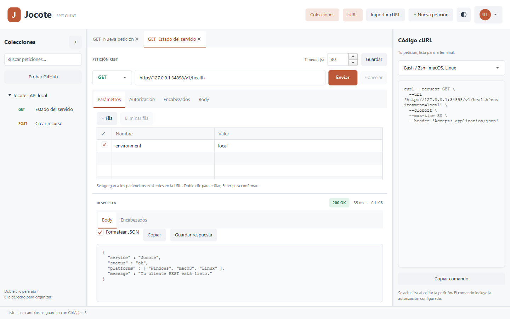

# Jocote

Cliente REST de escritorio en **Java 21 y JavaFX**, con un único código fuente para **Windows, macOS y Linux**. Esta primera versión implementa el flujo esencial de trabajo solicitado, inspirado en Postman.



*Captura de Jocote en Windows con tema claro: petición a un servidor local de pruebas, respuesta HTTP 200 y su comando cURL.*

## Ejecutar

**Recomendado para desarrollar: JDK 21, Maven 3.9.x y ejecución mediante Maven desde la carpeta que contiene pom.xml.** Se necesita una sesión gráfica para abrir la ventana y conexión a internet para la primera descarga de dependencias.

El proyecto fija JavaFX **21.0.12** en [pom.xml](pom.xml). Maven resuelve los módulos y librerías nativas del sistema actual; normalmente no necesitas instalar el SDK de JavaFX por separado. El [plugin oficial de JavaFX](https://github.com/openjfx/javafx-maven-plugin) prepara las rutas de módulos y clases.

```sh
java -version
mvn -version
mvn clean javafx:run
```

Comprueba que `java -version` y el Java indicado por `mvn -version` correspondan al JDK 21 elegido. Un `JAVA_HOME` diferente del Java de `PATH` puede hacer que Maven compile con un JDK y el lanzador use otro.

### Windows — PowerShell

Instala un JDK 21, por ejemplo [Eclipse Temurin](https://adoptium.net/temurin/releases/?version=21), y [Apache Maven 3.9.x](https://maven.apache.org/download.cgi). Abre una nueva terminal después de configurar `JAVA_HOME` y agregar los directorios `bin` a `PATH`.

Si todavía no están configurados, este ejemplo los establece **solo para la terminal actual**. Reemplaza ambas rutas por tus instalaciones reales:

```powershell
$env:JAVA_HOME = 'C:\DevTools\jdk-21'
$env:Path = "$env:JAVA_HOME\bin;C:\DevTools\apache-maven-3.9.x\bin;$env:Path"
Get-Command java, mvn
java -version
mvn -version
```

Desde el proyecto:

```powershell
Set-Location 'C:\ruta\jocote'
mvn clean javafx:run
```

Para usar el lanzador, primero compila y luego ejecútalo:

```powershell
mvn clean package
.\Jocote.bat
```

También puedes abrir `Jocote.bat` con doble clic; conserva visibles los errores. El lanzador usa el `java` de `PATH`.

### Linux — Bash

Instala JDK 21 y Maven 3.9.x mediante SDKMAN (sección siguiente) o el gestor de tu distribución. Abre una terminal dentro de una sesión de escritorio:

```bash
cd /ruta/jocote
java -version
mvn -version
mvn clean javafx:run
```

Alternativamente:

```bash
mvn clean package
sh jocote.sh
```

`sh jocote.sh` no requiere cambiar permisos. Si prefieres ejecutarlo directamente, usa `chmod +x jocote.sh` una vez y después `./jocote.sh`.

Si aparece un error de carga de GTK, instala el runtime GTK 3 de tu distribución. Por ejemplo, en **Ubuntu 24.04** el paquete es [libgtk-3-0t64](https://packages.ubuntu.com/noble/libgtk-3-0t64):

```bash
sudo apt update
sudo apt install libgtk-3-0t64
```

El nombre del paquete puede variar en otras distribuciones. Un error `Unable to open DISPLAY` requiere una sesión gráfica disponible; descargar más JARs no crea esa sesión. Para pruebas en un servidor sin escritorio consulta **Validación** con Xvfb.

### macOS — Terminal (Zsh o Bash)

Instala JDK 21 y Maven 3.9.x con SDKMAN (sección siguiente), o usa tus instalaciones existentes. En Apple Silicon, utiliza JDK y JavaFX ARM64; en Intel, x64. Evita mezclar una JVM ejecutada bajo Rosetta con librerías nativas ARM64.

Si instalaste el JDK mediante un instalador de macOS, puedes seleccionarlo para la terminal actual:

```sh
export JAVA_HOME=$(/usr/libexec/java_home -v 21)
export PATH="$JAVA_HOME/bin:$PATH"
```

Con SDKMAN, utiliza `sdk use java` como se muestra más abajo. Después:

```sh
cd /ruta/jocote
java -version
mvn -version
mvn clean javafx:run
```

También funciona el lanzador del proyecto:

```sh
mvn clean package
sh jocote.sh
```

### Instalar y seleccionar Java/Maven con SDKMAN

SDKMAN funciona con Bash/Zsh en Linux y macOS. En Windows, usa **WSL** para este procedimiento; no ejecutes estos comandos directamente en PowerShell o CMD. Consulta la [instalación oficial de SDKMAN](https://sdkman.io/install/).

Necesitas `curl`, `zip` y `unzip`. En una terminal Bash:

```bash
curl -s "https://get.sdkman.io" | bash
source "$HOME/.sdkman/bin/sdkman-init.sh"
sdk version
sdk list java
sdk list maven
```

De las listas, elige un **JDK 21** (por ejemplo, un identificador Temurin terminado en `-tem`) y **Maven 3.9.x** disponibles para tu sistema. Sustituye los valores siguientes por identificadores exactos de esas listas; no uses los marcadores literalmente:

```bash
JOCOTE_JAVA_ID='ID_EXACTO_DEL_JDK_21'
JOCOTE_MAVEN_VERSION='VERSION_EXACTA_DE_MAVEN_3.9'
sdk install java "$JOCOTE_JAVA_ID"
sdk install maven "$JOCOTE_MAVEN_VERSION"
sdk use java "$JOCOTE_JAVA_ID"
sdk use maven "$JOCOTE_MAVEN_VERSION"
sdk current
java -version
mvn -version
cd /ruta/jocote
mvn clean javafx:run
```

`sdk use` selecciona versiones para esa terminal. Para hacerlas predeterminadas en nuevas terminales, usa opcionalmente `sdk default java "$JOCOTE_JAVA_ID"` y `sdk default maven "$JOCOTE_MAVEN_VERSION"`. La [guía de uso de SDKMAN](https://sdkman.io/usage/) describe estas operaciones. Si no reconoce `sdk`, abre una nueva terminal o vuelve a cargar `sdkman-init.sh`.

**Windows con WSL:** instala Java y Maven dentro de la distribución Linux y ejecuta `sh jocote.sh` o Maven allí. Necesitas [soporte gráfico WSLg](https://learn.microsoft.com/en-us/windows/wsl/tutorials/gui-apps) o un servidor gráfico configurado. Ese entorno utiliza librerías JavaFX Linux: conserva un checkout y un `target/` separados de los usados por Java nativo de Windows.

### Ejecutar el JAR compilado

```sh
mvn clean package
java -jar target/jocote-0.1.0-SNAPSHOT.jar
```

El JAR requiere Java 21+ y **la carpeta lib junto al JAR**, tal como Maven la genera:

```text
target/
  jocote-0.1.0-SNAPSHOT.jar
  lib/
    javafx-*.jar
    jackson-*.jar
```

No es un JAR autocontenido. Al copiarlo, conserva la carpeta `lib` y su contenido. Los lanzadores compilan únicamente si no existe el JAR; después de cambiar código o si falta `lib`, ejecuta `mvn clean package` explícitamente. Compila en el sistema/arquitectura destino: no reutilices un `target/` generado en otro sistema.

### Workarounds cuando no encuentra JavaFX

| Mensaje o síntoma | Qué revisar / solución |
| --- | --- |
| `JavaFX runtime components are missing` | Inicia con `mvn clean javafx:run` o usa el JAR con `dev.jocote.Launcher` como entrada. En el IDE, utiliza la tarea Maven `javafx:run` en lugar de lanzar la clase Application sin sus módulos. |
| `NoClassDefFoundError: javafx/...` / `ClassNotFoundException` | Confirma que compilaste con `package` y que `target/lib` está completo junto al JAR. Recompila con `mvn clean package`. |
| `Module javafx.controls not found` / `Module javafx.graphics not found` | Revisa el module-path o usa los comandos explícitos de abajo. El module-path debe apuntar al directorio que contiene los JARs. |
| `UnsatisfiedLinkError`, `no glass in java.library.path` o error al cargar Prism | Comprueba sistema, arquitectura y dependencias gráficas. No mezcles DLL de Windows, SO de Linux o dylib de macOS. Reconstruye en el entorno donde vas a ejecutar. |
| `UnsupportedClassVersionError` / `release version 21 not supported` | Revisa `java -version`, `mvn -version`, `JAVA_HOME` y el JDK configurado en el IDE; usa JDK 21. |
| `Unable to open DISPLAY` | Falta una sesión gráfica en Linux/WSL/SSH; utiliza un escritorio, WSLg o Xvfb para pruebas. |

**1. Recuperar dependencias mediante Maven.** Ejecuta desde la raíz del proyecto:

```sh
mvn -U clean package
mvn dependency:tree "-Dincludes=org.openjfx"
mvn javafx:run
```

`-U` fuerza a Maven a revisar resoluciones pendientes/actualizaciones; no repara por sí solo un JAR de release corrupto ya almacenado. Si la descarga falla, revisa el error de conexión, proxy o mirror de Maven antes de cambiar JavaFX. `clean` elimina la salida de compilación de `target/`, no el workspace personal.

**2. Arranque modular explícito, sin descargar otro SDK.** Después de `mvn clean package`, utiliza las librerías ya presentes en `target/lib`:

Windows / PowerShell:

```powershell
java --module-path "target/jocote-0.1.0-SNAPSHOT.jar;target/lib" -m dev.jocote/dev.jocote.JocoteApplication
```

Linux / macOS:

```sh
java --module-path "target/jocote-0.1.0-SNAPSHOT.jar:target/lib" -m dev.jocote/dev.jocote.JocoteApplication
```

El separador entre entradas es `;` en Windows y `:` en Linux/macOS. Este modo evita depender del classpath configurado por el IDE; sigue necesitando los JARs nativos correctos.

**3. SDK JavaFX local como alternativa manual.** Si necesitas proporcionar JavaFX explícitamente, descarga el **SDK 21.0.12** para tu sistema y arquitectura desde [Gluon/OpenJFX](https://gluonhq.com/products/javafx/) y descomprímelo completo. Usa la versión definida en `pom.xml`, no automáticamente la versión más nueva. Conserva el JAR de Jocote y `target/lib` generado por Maven, porque también se necesita Jackson.

Windows / PowerShell (ajusta la ruta real del SDK):

```powershell
$env:JOCOTE_FX_LIB = 'C:\ruta\javafx-sdk-21.0.12\lib'
java --module-path "$env:JOCOTE_FX_LIB" --add-modules javafx.controls -jar target/jocote-0.1.0-SNAPSHOT.jar
```

Linux / macOS:

```sh
export JOCOTE_FX_LIB="/ruta/javafx-sdk-21.0.12/lib"
java --module-path "$JOCOTE_FX_LIB" --add-modules javafx.controls -jar target/jocote-0.1.0-SNAPSHOT.jar
```

`JOCOTE_FX_LIB` apunta a **lib**, no a la raíz del SDK. Mantén también los archivos nativos del SDK. Esta alternativa resuelve la ubicación de JavaFX en ejecución; no sustituye el resto de dependencias ni repara problemas de pantalla o arquitectura.

**4. Ejecutar sin un Java instalado por separado.** Si ya tienes una imagen de Jocote para tu sistema/arquitectura, usa su lanzador `bin/Jocote.bat` (Windows) o `bin/Jocote` (Linux/macOS). La imagen incluye JVM y JavaFX; para construirla desde el proyecto consulta **Distribución por plataforma**.

## Funciones

### Probar una API pública en un clic

1. Abre Jocote y pulsa **Probar GitHub** en el panel izquierdo.
2. Se guarda la colección **Demo GitHub** y se ejecuta `GET https://api.github.com/repos/berroteran/jocote`.
3. En **Respuesta** verás el estado HTTP, tiempo, tamaño y JSON real devuelto por GitHub; a la derecha aparece el cURL equivalente.
4. Abre con doble clic las otras peticiones de la colección y pulsa **Enviar**.

| Petición | Qué demuestra |
| --- | --- |
| Repositorio Jocote | Consulta de un recurso público y lectura de su JSON. |
| Perfil de berroteran | Consulta de un usuario público. |
| Repositorios públicos | Parámetros `per_page=5` y `sort=updated`; respuesta como lista. |
| Lenguajes de Jocote | Respuesta JSON pequeña con los lenguajes del repositorio. |

Las cuatro peticiones son GET y no requieren token. GitHub aplica límites a las peticiones sin autenticación; cualquier error o límite se muestra en la respuesta. Los endpoints públicos están documentados en [GitHub REST API](https://docs.github.com/en/rest/repos/repos#get-a-repository).

La colección está incluida en [demo-github.json](src/main/resources/dev/jocote/demo-github.json). Se agrega una sola vez y no reemplaza las colecciones existentes. Pulsar de nuevo el botón reutiliza la colección guardada, incluidas tus ediciones. No se realizan peticiones a GitHub al abrir normalmente la aplicación.

Para iniciar y ejecutar directamente la demo:

```sh
mvn javafx:run "-Djavafx.args=--demo"
```

También puedes usar `Jocote.bat --demo` en Windows o `sh jocote.sh --demo` en macOS/Linux, después de recompilar con `mvn package`.

### Importar un comando cURL

1. Pulsa **Importar cURL** en la barra superior.
2. Selecciona la sintaxis de origen: **Bash** o **PowerShell 7.3+**. Pega un comando `curl` o `curl.exe`, con URL y datos entre comillas.
3. Pulsa **Importar**. Se abre una pestaña nueva con método, URL, encabezados, autorización Basic y body editables. La petición queda pendiente de guardar.
4. Revisa los campos y pulsa **Enviar** para ver la respuesta, o **Guardar** para agregarla a una colección.

Ejemplo público sin autenticación, válido en ambos modos:

```sh
curl 'https://api.github.com/repos/berroteran/jocote' -H 'Accept: application/json'
```

| Opciones admitidas | Comportamiento |
| --- | --- |
| URL posicional / `--url`, `-X` / `--request` | Una sola URL HTTP/HTTPS y método explícito; GET por defecto, POST cuando hay datos. |
| `-H` / `--header`, `-A` / `--user-agent` | Encabezados editables, incluidos Authorization y headers repetidos. `Nombre;` representa un valor vacío. |
| `-u` / `--user`, `--basic` | Credenciales literales `usuario:contraseña` en el editor de autorización Basic. |
| `-d` / `--data`, `--data-ascii`, `--data-raw`, `--data-binary` | Contenido pegado en el comando; las partes repetidas se unen con `&`. No se leen archivos. |
| `--data-urlencode`, `--json` | Codificación UTF-8 de valores de formulario; JSON agrega Content-Type y Accept si no se especificaron. |
| `-G` / `--get`, `-I` / `--head` | Datos como query y peticiones HEAD, respectivamente. |
| `-m` / `--max-time`, `-g` / `--globoff` | Timeout entero de 1–600 segundos y URL literal sin expansión de rangos. |
| `-s`, `-S`, `-i` y sus formas largas | Opciones de salida de terminal: se informa que se omiten, porque la respuesta se muestra en Jocote. |

Se admiten opciones cortas con valor adjunto (`-XPOST`), largas con `=` y continuaciones de línea con `\` en Bash o backtick en PowerShell. La query permanece en la URL para conservar parámetros repetidos y su codificación; el formulario se abre como texto codificado, sin recodificarlo. El cURL del panel derecho se actualiza con la petición importada.

El importador analiza texto: **no ejecuta comandos, no lee archivos y no envía peticiones**. Las opciones no soportadas (por ejemplo `--location`, `--insecure`, `--compressed`, multipart, proxy o `@archivo`) bloquean la importación con una explicación. También rechaza scripts, expansiones de variables, múltiples URLs y combinaciones que no puede representar. `cmd.exe`, ANSI-C quoting de Bash y expresiones PowerShell quedan fuera de este subconjunto.

Los valores de transporte no especificados siguen siendo los de Jocote: timeout de 30 segundos, configuración del cliente Java y sus headers automáticos. No se cargan archivos de configuración ni preferencias del cURL instalado. Semántica de las opciones basada en el [manual oficial de cURL](https://curl.se/docs/manpage.html).

### Cliente REST

- Panel izquierdo de colecciones, colapsable y redimensionable: crear, renombrar, eliminar, buscar y duplicar peticiones.
- Pestañas independientes para peticiones GET, POST, PUT, PATCH, DELETE, HEAD, OPTIONS y TRACE.
- Parámetros de query y encabezados editables, con activación por fila y valores repetidos.
- Autorización: ninguna, Bearer, Basic y API key en encabezado o query.
- Body: JSON, texto, XML y `application/x-www-form-urlencoded`. Content-Type automático, reemplazable por un encabezado explícito.
- Envío asíncrono, cancelación y timeout por petición de 1 a 600 segundos.
- Respuesta: código HTTP, tiempo, tamaño, encabezados, texto, búsqueda y ajuste de líneas; JSON/XML formateado, árbol JSON, código coloreado, imágenes, HTML estático y consultas JSONPath/XPath. Guardado de los bytes originales.
- Panel derecho cURL colapsable, con generación en vivo para Bash/Zsh y PowerShell 7.3+.
- Guardado local de colecciones y aviso al cerrar pestañas con cambios pendientes.
- Atajos adaptados: Ctrl en Windows/Linux y ⌘ en macOS.

| Acción | Atajo |
| --- | --- |
| Nueva petición | Ctrl/⌘ + N |
| Enviar | Ctrl/⌘ + Enter |
| Guardar | Ctrl/⌘ + S |
| Cerrar pestaña | Ctrl/⌘ + W |

Doble clic sobre una celda para editar; Enter confirma el valor. Los parámetros del editor se agregan a los existentes en la URL. El cURL representa la pestaña activa, no necesariamente la última petición ejecutada.

### Explorar una respuesta (JOC-047)

Después de **Enviar**, el panel de respuesta ofrece cuatro pestañas:

| Pestaña | Uso |
| --- | --- |
| **Body** | Texto seleccionable, búsqueda literal con distinción de mayúsculas, botones anterior/siguiente y ajuste de líneas. Desmarca **Formatear JSON/XML** para ver el texto original. **Copiar** copia lo mostrado; **Guardar respuesta** conserva los bytes originales recibidos. |
| **Vista** | JSON como árbol colapsable o código con colores y números de línea; XML como código coloreado; imágenes PNG/JPEG/GIF/BMP; HTML como texto con títulos, énfasis y listas. El contenido determina la vista disponible. |
| **Consulta** | JSONPath sobre JSON o XPath 1.0 sobre XML, con resultados copiables, búsqueda y mensajes de error. Las consultas son locales y no envían peticiones. |
| **Encabezados** | Protocolo y encabezados HTTP de la respuesta. |

En JSON, usa **Vista → Árbol / Código** para alternar. Seleccionar una hoja del árbol habilita **Copiar valor**. El resaltado es de lectura: el editor del body del request mantiene su botón de formato, todavía sin resaltado de sintaxis. La selección libre de texto y la búsqueda están disponibles en **Body** y en los resultados de **Consulta**. La vista coloreada limita cada línea a 8 192 caracteres; Body conserva la vista de texto hasta su límite general.

Ejemplos de consultas:

| Formato | Consulta | Resultado |
| --- | --- | --- |
| JSONPath | `$.items[*].name` | Valores de `name` en los elementos del arreglo. |
| JSONPath | `$['clave.con.puntos']` | Propiedad cuyo nombre contiene puntos. |
| JSONPath | `$.items[-1]` | Último elemento del arreglo. |
| JSONPath | `$..id` | Propiedades `id` en cualquier nivel. |
| XPath | `//item/@id` | Valores del atributo `id`. |
| XPath | `count(//item)` | Cantidad de elementos `item`. |
| XPath | `//*[local-name()='item']` | Elementos con ese nombre local, independientemente de su namespace. |

**Alcance de JSONPath:** raíz `$`, propiedades, claves entre comillas, índices positivos/negativos, comodines y descendientes recursivos. No se admiten filtros, slices, uniones ni funciones; se informa el límite sin devolver una interpretación parcial. No se promete conformidad completa con [RFC 9535](https://www.rfc-editor.org/rfc/rfc9535.html). XPath admite los prefijos declarados en la raíz del documento; para namespaces predeterminados o declarados solo en elementos interiores, usa `local-name()` y `namespace-uri()`.

**Límites del visor:** texto de hasta 300 000 caracteres y salida formateada/consultada del mismo tamaño máximo; hasta 128 niveles y 10 000 nodos al construir vistas estructuradas. Las consultas admiten hasta 1 024 caracteres y 1 000 resultados; JSONPath limita además a 64 selectores y 200 000 visitas. La búsqueda textual navega las primeras 10 001 coincidencias e indica `10 000+` cuando alcanza ese límite. Si una vista no puede generarse, se mantiene el texto original y el guardado del archivo. Un JSON con claves duplicadas se muestra como texto para evitar ocultar valores.

Las imágenes se validan antes de decodificar: máximo 8 192 píxeles por lado y 16 millones de píxeles en total. Se muestra una vista reducida de hasta 1 600 × 1 600 y solo el primer fotograma de GIF. SVG se trata como XML, sin renderizar recursos activos.

La vista HTML es una representación estática con controles JavaFX, sin navegador embebido: no interpreta JavaScript ni CSS, no activa enlaces/formularios y no descarga imágenes, iframes o recursos externos. No pretende reproducir el diseño completo de una página web. El parser XML bloquea DTD y entidades externas; no ejecuta XInclude ni hojas de estilo. El análisis, las consultas y la decodificación de imágenes se ejecutan fuera del hilo gráfico; cambiar de respuesta o cerrar su pestaña cancela el trabajo anterior y evita que reemplace la vista nueva.

### Temas y perfil local

Después de **+ Nueva petición**, el botón de círculo dividido recorre **Jocote claro → Jocote oscuro → Modena → Caspian → Jocote claro**. El tooltip indica el tema actual y el siguiente. Modena y Caspian son los [temas nativos de JavaFX](https://openjfx.io/javadoc/21/javafx.graphics/javafx/application/Application.html); claro y oscuro son las paletas de Jocote. Los look-and-feel de Swing no se aplican a controles JavaFX.

El último botón de la derecha muestra un avatar circular de iniciales. Su menú incluye **Mi perfil…**, para editar nombre, alias y correo opcionales, y **Apariencia**, para seleccionar directamente cualquiera de los cuatro temas. Guardar actualiza el avatar; Cancelar conserva los datos anteriores. El perfil es local, sin registro ni inicio de sesión.

En **Avatar → Densidad visual**, selecciona **Compacta**, **Normal** o **Amplia**. El cambio ajusta márgenes, separación entre componentes, padding de controles y altura de filas en tiempo real, también en nuevas pestañas y diálogos. Compacta aprovecha mejor el espacio; Normal conserva la distribución estándar. La densidad funciona con los cuatro temas y no cambia el tamaño de letra ni descarta peticiones o respuestas. Puedes ajustar por separado el reparto de espacio arrastrando los divisores de los paneles.

Tema, densidad y perfil se guardan en `preferences.json`, junto al workspace pero separados de las colecciones y credenciales. Los archivos anteriores que no tienen densidad usan Normal. Las escrituras se realizan fuera del hilo gráfico y el cambio se aplica después de guardarlo. Si el archivo es inválido, Jocote conserva el original, utiliza valores temporales e informa que no puede guardar las preferencias hasta corregirlo. El tema automático del sistema, la carga de fotografías y la selección de idioma todavía no están implementados.

Los valores de espaciado de cada densidad están centralizados en [jocote-density.css](src/main/resources/dev/jocote/jocote-density.css), independientes de la paleta de colores.

## Datos locales y comportamiento HTTP

El workspace se guarda en `${user.home}/.jocote/workspace.json`. No se requiere una base de datos ni un backend. Para usar otro directorio:

```sh
java -Djocote.home=/ruta/al/workspace -jar target/jocote-0.1.0-SNAPSHOT.jar
```

En PowerShell, encierra `"-Djocote.home=C:\ruta\workspace"` entre comillas si contiene espacios. El guardado reemplaza el archivo de manera atómica cuando el sistema de archivos lo permite. Si el archivo existente está corrupto o tiene una versión incompatible, la aplicación muestra un error y lo conserva intacto.

**Las colecciones y las credenciales se guardan en texto plano.** cURL también incluye las credenciales configuradas. No subas tu workspace al repositorio. Esta versión no incorpora almacén seguro del sistema operativo ni coordinación de escrituras entre varias instancias; utiliza una instancia por workspace.

El cliente verifica certificados TLS y nombres de host. Los redirects se muestran como respuestas 3xx, sin seguirlos automáticamente. No se conserva una sesión de cookies automáticamente. Los encabezados `Host`, `Content-Length`, `Connection`, `Expect` y `Upgrade` están administrados/restringidos por el cliente HTTP de Java.

Las respuestas tienen un máximo de 10 MiB; la vista muestra hasta 300 000 caracteres. El guardado conserva todos los bytes recibidos dentro del límite. La previsualización de imágenes tiene los límites descritos en **Explorar una respuesta**. No hay descompresión manual de respuestas HTTP comprimidas. La aplicación no solicita compresión por defecto.

## Organización

```text
src/main/java/
  module-info.java             Módulo JPMS dev.jocote
  dev/jocote/
    JocoteApplication.java     Composición y ciclo de vida
    Launcher.java              Entrada alternativa para distribución JAR
    model/                     Records y contratos de datos
    service/                   Preparación, HTTP, cURL y operaciones de workspace
    repository/                Serialización JSON y escritura a disco
    ui/                        Componentes y controladores JavaFX
src/main/resources/            Estilos compartidos
src/test/java/                 Pruebas de lógica, integración HTTP y UI
.github/workflows/build.yml    Matriz de construcción para los tres sistemas
```

La UI no construye encabezados ni codifica parámetros. `RequestPreparer` produce una petición normalizada que comparten el servicio HTTP y el generador cURL. Los servicios y modelos no dependen de JavaFX. El acceso a disco se encapsula en el repositorio; el servicio de workspace publica los cambios en memoria después de guardarlos correctamente.

Dependencias de producción: JavaFX Controls y Jackson. HTTP utiliza `java.net.http.HttpClient`. El visor reutiliza `java.xml` y `java.desktop` del JDK para XML/XPath, análisis de HTML e imágenes; la interfaz sigue siendo JavaFX y no agrega un motor web ni dependencias Maven. No hay Spring ni contenedor de inyección: las dependencias se conectan explícitamente al iniciar la aplicación.

## Validación

```sh
mvn -B -ntp verify
```

Las pruebas normales usan un servidor HTTP local y directorios temporales. No consumen APIs externas ni modifican colecciones personales. Cubren codificación, autorización, generación/importación cURL en ambos shells, rechazo de opciones no soportadas, persistencia, errores HTTP, redirects, Unicode, timeout, cancelación y límite de respuesta.

La prueba gráfica es optativa porque requiere un escritorio:

```sh
mvn "-Djocote.uiTest=true" "-Dtest=JavaFxSmokeTest" test
```

En Linux sin escritorio:

```sh
xvfb-run -a mvn -Djocote.uiTest=true -Dtest=JavaFxSmokeTest test
```

Esta prueba abre JavaFX, verifica controles, ejecuta una petición contra un servidor local y guarda una captura en `target/jocote-preview.png`. También prueba cancelar la importación, corregir un comando inválido, importar cURL en una pestaña sin enviar automáticamente y mostrar la respuesta después de pulsar Enviar. Recorre los cuatro temas, comprueba el orden de los botones y el ancho mínimo de ventana, edita/cancela el perfil y genera capturas `target/jocote-theme-*.png` y `target/jocote-profile-*.png`. Los tests se ejecutan en classpath; producción se ejecuta como módulo con Maven o el runtime generado.

La prueba gráfica también recorre el visor de respuestas: árbol y colores JSON en los cuatro temas, consultas JSONPath/XPath, búsqueda, ajuste de líneas, HTML estático, imagen PNG y sustitución de una respuesta mientras se analiza la anterior. Genera capturas `target/jocote-response-*.png`. Las pruebas del servicio verifican límites, rechazo de JSON/XML inválido, bloqueo de entidades externas y ausencia de peticiones al analizar recursos HTML/XML.

Para verificar además las cuatro peticiones reales de la demo desde JavaFX (requiere internet y consume cuatro peticiones públicas a GitHub):

```sh
mvn "-Djocote.uiTest=true" "-Djocote.githubTest=true" "-Dtest=JavaFxSmokeTest" test
```

Esta verificación exige `200 OK` y el contenido esperado en cada respuesta, y genera `target/jocote-github-demo.png` y `target/github-demo-results.txt`. Es optativa: la suite normal y CI no dependen de GitHub.

## Distribución por plataforma

Para generar una imagen que incluya Java y JavaFX:

```sh
mvn clean verify javafx:jlink
```

El resultado está en `target/jocote-runtime/` y `target/jocote-runtime.zip`. Ejecuta `bin/Jocote.bat` en Windows o `bin/Jocote` en macOS/Linux. El usuario de esa distribución no necesita instalar Java ni Maven.

**La imagen debe construirse en el sistema y arquitectura destino.** El código es común; las librerías nativas de JavaFX y la JVM son específicas de la plataforma. La matriz de GitHub Actions construye, prueba la interfaz y publica un ZIP por runner. Windows ARM64, Linux ARM64 y otras arquitecturas requieren runners compatibles y validación adicional. La configuración CI no equivale a haber ejecutado esos sistemas localmente.

La imagen es portable; esta versión no genera instaladores MSI/DMG/DEB, firma de código ni notarización. En macOS, la distribución externa requerirá considerar los requisitos de firma de Apple.

## Alcance de esta versión

No es una réplica completa de Postman. Quedan fuera de esta primera entrega: importación/exportación Postman/OpenAPI, entornos y variables, historial, scripts y tests de colecciones, OAuth interactivo, multipart/archivos como body, WebSocket/gRPC, clientes TLS personalizados y colaboración/sincronización en nube.

## Autor

**Omar Berroterán Silva**

GitHub: [@berroteran](https://github.com/berroteran)

## Referencias

- [OpenJFX: configuración con Maven](https://openjfx.io/openjfx-docs/maven)
- [Plugin oficial JavaFX: ejecución y jlink](https://github.com/openjfx/javafx-maven-plugin)
